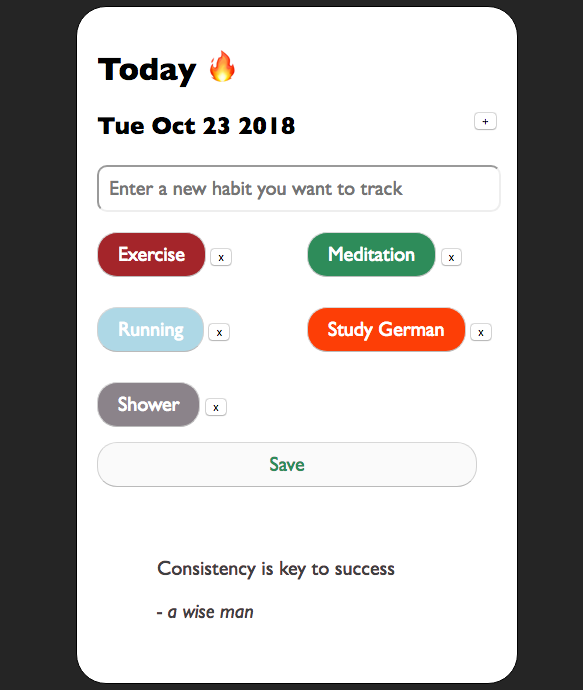

# Readme

This app helps you track you daily habit such as exercise or meditation.

Developed by _Lorenzo Cella_ using Vue.

## How to start

- clone the repo
- open main.html

## To Do

- [] (Simple save) add local storage

- [] (Vuex) save state

- [] (save synced) add sync storage to get it synced between all chrome

- [] (Database) record each day in a database. Using firebase?

- [] (Autentication) Log in. Really needed?

- [] (Report) end of the week, end of the month report on consistency

- [x] (Vue) make it reactive

- [x] (Style) modify the aestetics

- [x] (Customizable) choose which habit to track